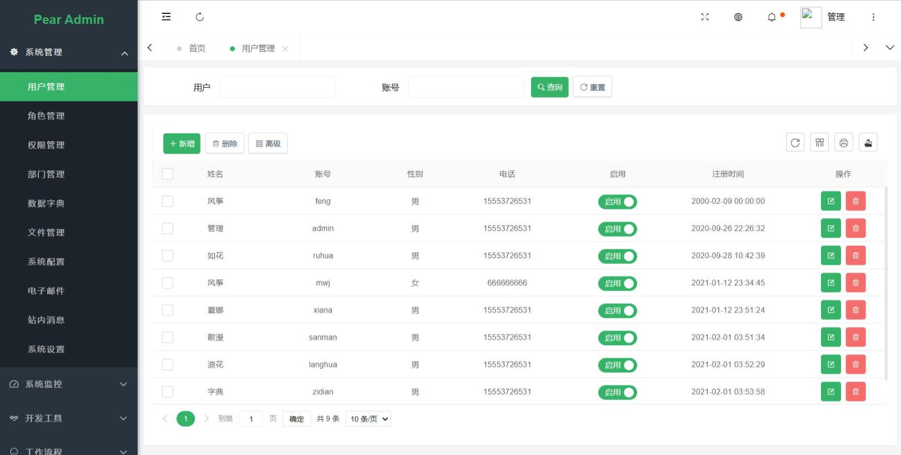

<div align="center">
<br/>
<br/>
  <h1 align="center">
    Smart Test
  </h1>
  <h3 align="center">
    自 动 化 测 试 平 台
  </h3> 
  <h5 align="center">
    基于 Pearadmin Flask
  </h5> 

  
[Pearadmin 官 网](http://www.pearadmin.com/)

<p align="center">
    <a href="#">
        
    </a>
    <a href="#">
        
    </a>
      <a href="#">
        
    </a>
</p>
</div>

<div align="center">
  
</div>

#### Pearadmin项目简介
>基于 Pearadmin Flask的测试系统，拥抱应用广泛的python语言，通过使用本系统，即可快速构建你的功能业务
>https://gitee.com/pear-admin/pear-admin-flask/tree/master/
>项目旨在为python开发者提供一个后台管理系统的模板，成为您构建信息管理系统，物联网后台....等等应用时灵活，简单的工具
>
>众人拾柴火焰高，欢迎pythoner参与项目~


####  Pearadmin内置功能

- [x] 用户管理：用户是系统操作者，该功能主要完成系统用户配置。
- [x] 权限管理：配置系统菜单，操作权限，按钮权限标识等。
- [x] 角色管理：角色菜单权限分配。
- [x] 操作日志：系统正常操作日志记录和查询；系统异常信息日志记录和查询。
- [x] 登录日志：系统登录日志记录查询包含登录异常。
- [x] 服务监控：监视当前系统CPU、内存、磁盘、python版本,运行时长等相关信息。
- [x] 文件上传:   图片上传示例
- [x] 定时任务:   简单的定时任务
- 用例管理：用例列表、增加用例、批量导入、用例转换、故事测试
- 任务管理：测试任务、自动更新swagger接口文档
- 报告管理：测试报告
- 接口列表

####  Pearadmin项目结构
```
├─applications  # 应用
│  ├─configs  # 配置文件
│  │  ├─ common.py  # 普通配置
│  │  └─ config.py  # 配置文件对象
│  ├─extensions  # 注册插件
│  ├─models  # 数据模型
│  ├─static  # 静态资源文件
│  ├─templates  # 静态模板文件
│  └─views  # 视图部分
│     ├─admin  # 后台管理视图模块
│     └─index  # 前台视图模块
      └─test  # 自动化测试视图模块
├─docs  # 文档说明
├─migrations  # 迁移文件记录
├─requirement  # 依赖文件
├─test # 测试文件夹
└─.flaskenv # 项目的配置文件

```


#### 项目安装

```bash
# 下 载
git clone

# 安 装
pip install -r requirement\requirement-dev.txt

# 配 置
.env

```

#### 修改配置

```python
.flaskenv
# MySql配置信息
MYSQL_HOST=127.0.0.1
MYSQL_PORT=3306
MYSQL_DATABASE=PearAdminFlask
MYSQL_USERNAME=root
MYSQL_PASSWORD=root

# Redis 配置
REDIS_HOST=127.0.0.1
REDIS_PORT=6379

# 密钥配置
SECRET_KEY='pear-admin-flask'

# 邮箱配置
MAIL_SERVER='smtp.qq.com'
MAIL_USERNAME='123@qq.com'
MAIL_PASSWORD='' # 生成的授权码
```

#### Venv 安装

```bash
python -m venv venv
```
激活虚拟环境
#### 运行项目

```bash
# 初 始 化 数 据 库

flask init
```

执行 flask run 命令启动项目

数据库提前设置默认字符编码utf8mb4，如果不设置插入中文数据会报错。
ALTER TABLE story DEFAULT CHARACTER SET utf8mb4 [COLLATE collation_name];修改列的字符集
ALTER TABLE story CONVERT TO CHARACTER SET utf8mb4;修改表的所有列的字符集


```bash
# 示例
#### 命令行创建视图
flask new --type view --name test/a

# 自动注册蓝图
# 访问http://127.0.0.1:5000/test/a/
```

#### 预览项目

|  |  |
|---------------------|---------------------|
|   |   |
| |     |
   